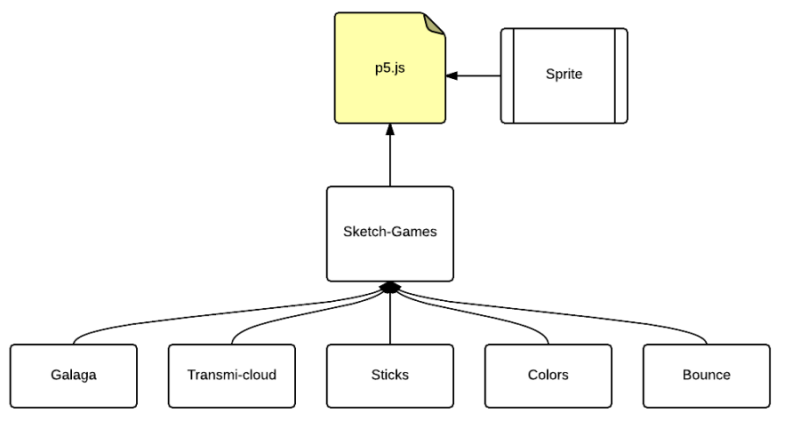

<section id="themes">
	<h2>Themes</h2>
		

			Set your presentation theme:  
			<!-- Hacks to swap themes after the page has loaded. Not flexible and only intended for the reveal.js demo deck. -->
			<a href="#" onclick="document.getElementById('theme').setAttribute('href','css/theme/black.css'); return false;">Black (default)</a> -
			<a href="#" onclick="document.getElementById('theme').setAttribute('href','css/theme/white.css'); return false;">White</a> -
			<a href="#" onclick="document.getElementById('theme').setAttribute('href','css/theme/league.css'); return false;">League</a> -
			<a href="#" onclick="document.getElementById('theme').setAttribute('href','css/theme/sky.css'); return false;">Sky</a> -
			<a href="#" onclick="document.getElementById('theme').setAttribute('href','css/theme/beige.css'); return false;">Beige</a> -
			<a href="#" onclick="document.getElementById('theme').setAttribute('href','css/theme/simple.css'); return false;">Simple</a>  
			<a href="#" onclick="document.getElementById('theme').setAttribute('href','css/theme/serif.css'); return false;">Serif</a> -
			<a href="#" onclick="document.getElementById('theme').setAttribute('href','css/theme/night.css'); return false;">Night</a> -
			<a href="#" onclick="document.getElementById('theme').setAttribute('href','css/theme/moon.css'); return false;">Moon</a> -
			<a href="#" onclick="document.getElementById('theme').setAttribute('href','css/theme/solarized.css'); return false;">Solarized</a>
		

</section>

H:

# ** FUTURE GAMES **

by  [Sebastian Chaves](https://github.com/adamantwharf) - [Laura Santos](https://github.com/lsfinite) - [Jimmy Pulido](https://github.com/jiapulidoar)
I
H:

# Index

<!-- .slide: data-background="#7E2121" -->
 1. The main idea  <!-- .element: class="fragment" data-fragment-index="1"-->
 1. The way we did it <!-- .element: class="fragment" data-fragment-index="2"-->
 1. The Games <!-- .element: class="fragment" data-fragment-index="3"-->
 1. References <!-- .element: class="fragment" data-fragment-index="4"-->
H:

# *The main idea*
<!-- .slide: data-background="#005050" -->
V:

 ## What is it about?

  >The idea of the game was creat a serie of mini games. Easy to play, easy to lose.This will become attractive to the player, so she/he will play it again and again.  
  *Do you wanna play it?* <!-- .element: class="fragment" data-fragment-index="2"-->
V:
## Mini Games?:
Yeap, we have made five of them, so you can play the one you consider more interesting.
<!-- .element: class="fragment" data-fragment-index="1"-->

Just see the squares...  <!-- .element: class="fragment" data-fragment-index="2"-->

**And make your choice!!!** <!-- .element: class="fragment" data-fragment-index="3"-->
V:
## Objectives
* Short Term = Have a lot of video games. And try to join them as one big game that is design for include the mini games.
* Long Term = Make a complete game plataform. For pc ( Windows, Unix systems, GNU ), mobile devices ( android ) and of course the Web.

H:
# *The way we did it *:
Each one of the games is a class, and Games, is the super class.  
 </img>

H:
# *The Games*

* Galaga

* Clouds

* Sticks

* Colors

* Bounce

V:
### Galaga
<!-- .slide: data-background="#7E2121"  -->
  >A version of the clasic game. Is an arcade video game developed by Tomohiro Nishikado and released in 1978 <!-- .element: class="fragment" data-fragment-index="1"-->

More information on [Wikipedia](https://en.wikipedia.org/wiki/Space_Invaders) <!-- .element: class="fragment" data-fragment-index="1"-->

V:
#### Galaga Running! 
<!-- .slide: data-background="#000000"  -->
<iframe src="sketches/trafficLight.html" width="800" height="400" align="center">

H:

## Now Available for web:  

 http:// futureun.github.io/FutureGame 
<!-- .slide: data-background="#2E9AFE"  -->

V:
## References

* [P5*JS](http://p5js.org/)
* [P5.PLay](http://p5play.molleindustria.org/)
* [Sounds Resources](http://www.sounds-resource.com/)
