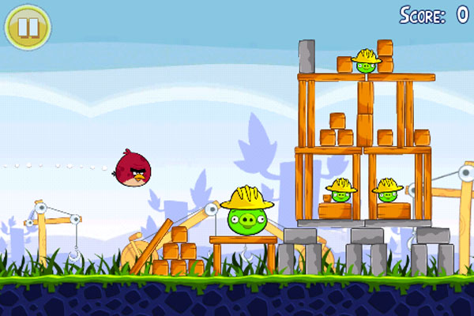

<section id="themes">
	<h2>Themes</h2>
		

			Set your presentation theme:  
			<!-- Hacks to swap themes after the page has loaded. Not flexible and only intended for the reveal.js demo deck. -->
			<a href="#" onclick="document.getElementById('theme').setAttribute('href','css/theme/black.css'); return false;">Black (default)</a> -
			<a href="#" onclick="document.getElementById('theme').setAttribute('href','css/theme/white.css'); return false;">White</a> -
			<a href="#" onclick="document.getElementById('theme').setAttribute('href','css/theme/league.css'); return false;">League</a> -
			<a href="#" onclick="document.getElementById('theme').setAttribute('href','css/theme/sky.css'); return false;">Sky</a> -
			<a href="#" onclick="document.getElementById('theme').setAttribute('href','css/theme/beige.css'); return false;">Beige</a> -
			<a href="#" onclick="document.getElementById('theme').setAttribute('href','css/theme/simple.css'); return false;">Simple</a>  
			<a href="#" onclick="document.getElementById('theme').setAttribute('href','css/theme/serif.css'); return false;">Serif</a> -
			<a href="#" onclick="document.getElementById('theme').setAttribute('href','css/theme/night.css'); return false;">Night</a> -
			<a href="#" onclick="document.getElementById('theme').setAttribute('href','css/theme/moon.css'); return false;">Moon</a> -
			<a href="#" onclick="document.getElementById('theme').setAttribute('href','css/theme/solarized.css'); return false;">Solarized</a>
		

</section>

H:

# **APRENDAMOS NAVEGANDO** 

Por  [Sebastian Chaves](https://github.com/adamantwharf)

H:

##¿Sabes qué es programar? 

</img>

>Darle instrucciones al computador para que haga algo  <!-- .element: class="fragment" data-fragment-index="1"-->

H:

## Por ejemplo puedes hacer:

V:

##Juegos 
</img>

V:

##Paginas de Internet 
</img>
V:

##Y muchas cosas más... 
</img>

H:
## *¿Sabías qué el computador toma desiciones?*

>El computador puede responder SI o NO antes de realizar una instrucción

V:
Aquí el computador se está preguntando ¿Estás haciendo clic en la pantalla?

<iframe src="sketches/clic.html" width="1000" height="600" align="center">

V:

##Cuando haces clic

>##	El computador realiza la acción

H:
# *Es tu turno*

>Ahora tu debes tomar una decisión antes de realizar una instrucción

V:
###  ¿Cuándo debo cruzar la calle?

>Oprime la tecla con la letra 'D' cuando creas que debes cruzar la calle

V:
#### Piensa con cuidado! 

<iframe src="sketches/trafficLight.html" width="1000" height="600" align="center">

H:

##   ¿Qué boton pulsarías? 

</img>

<!-- .slide: data-background="images/back.png"  -->

V:
## References

* [P5*JS](http://p5js.org/)
* [P5.PLay](http://p5play.molleindustria.org/)
* [Sounds Resources](http://www.sounds-resource.com/)
